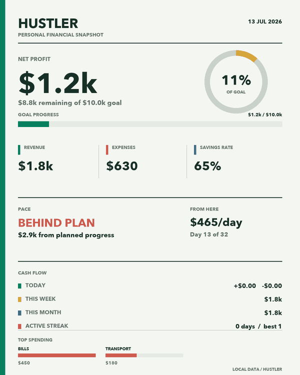

# Hustler

Hustler is a private macOS menu bar app for tracking financial goals without accounts, subscriptions, or cloud sync.

## Download

Download the build for your Mac from [Releases](https://github.com/momenbuilds/hustler-menubar/releases/latest), unzip it, and drag `Hustler.app` into Applications:

- Intel Macs: `Hustler-macOS-x86_64.zip`
- Apple-silicon Macs (M1, M2, M3, M4): `Hustler-macOS-arm64.zip`

On first launch, macOS may ask for confirmation because Hustler is not distributed through the App Store. Control-click `Hustler.app`, choose `Open`, then confirm once.

## First Launch

Hustler asks for your target amount, currency, start date, and target date. That is it. Your first goal is ready immediately.

## Use It Daily

- `Quick Log`: type `+500 client work` or `-120 Food lunch`.
- `Quick Add`: add common revenue amounts.
- `Add Revenue` and `Add Expense`: log detailed entries.
- `Insights`: see spending, budgets, streaks, milestones, and recent activity without making the main menu long.
- `Manage Entries`: edit, delete, or undo recent entries.
- `Settings`: switch goals, create another goal, set category budgets, and manage monthly recurring entries.
- `Tools`: import CSV files, export your current goal, view monthly review, copy a weekly recap, or create a progress card.

Each goal keeps its own entries and progress. The menu bar always shows the active goal.

## Updates

Hustler checks GitHub Releases once after launch. When a newer version is available, a small `Update Available` item appears at the top of the menu and opens the download.

## Privacy

Your data stays on your Mac in `~/Library/Application Support/Hustler/hustler_data.json`. Hustler has no accounts, analytics, or cloud sync.

The only network request is the one-time update check after launch. It only asks GitHub whether a newer public release exists.

## License

MIT
